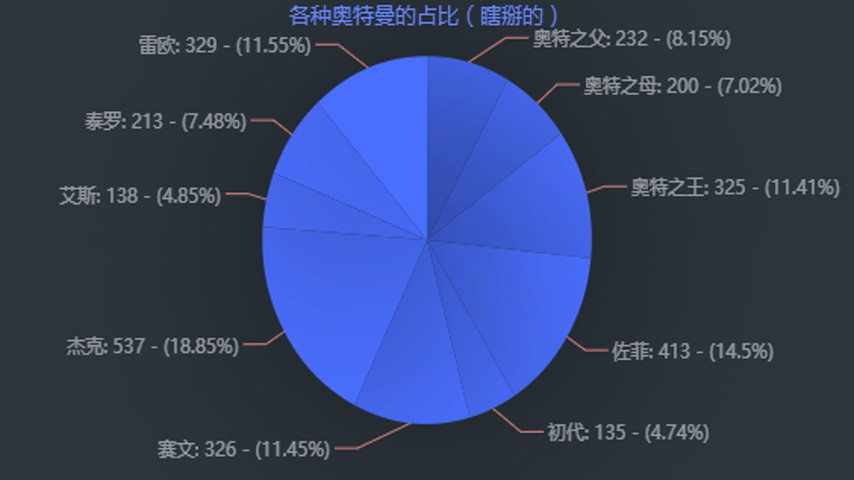

# React-echars-pie

#### 介绍
React+echars写的图表组件

#### 使用说明
安装echarts依赖
npm install echarts --save 

父组件准备数据
```bash
const data = [
  {value: 232, name: "奥特之父"},
  {value: 200, name: "奥特之母"},
  {value: 325, name: "奥特之王"},
  {value: 413, name: "佐菲"},
  {value: 135, name: "初代"},
  {value: 326, name: "赛文"},
  {value: 537, name: "杰克"},
  {value: 138, name: "艾斯"},
  {value: 213, name: "泰罗"},
  {value: 329, name: "雷欧"}
]
```
在父组件import这个组件之后在你想放它的地方写上它,然后给它传入数据，图表的标题
```bash
<EcharsPie data={data} title="各种奥特曼的占比（瞎掰的）"></EcharsPie>
```
echarspie.css的样式
```bash
.h-echarspie-box{
	width: 100%;
	height: 100%;
	margin: 0 auto;
}
.h-echarspie-box div{
	width: 100%;
	height: 100%;
}
```
#### 运行效果

